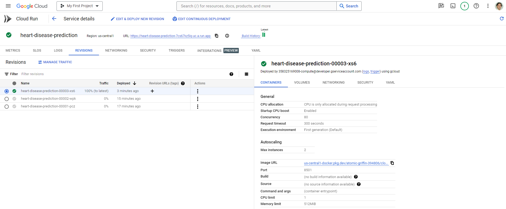

# Heart Disease Prediction App

This repository contains the source code for a Streamlit application that predicts heart disease based on patient characteristics and health attributes. The machine learning model used for prediction is a Random Forest Classifier.

**Disclaimer:** This project is for educational and demonstration purposes only. It should not be used as a substitute for professional medical advice, diagnosis, or treatment.

## Deployment

The application is deployed on Google Cloud Platform using the Cloud Run service. Continuous integration and deployment are implemented using Google Cloud Build.



## Usage

To use the application locally, follow these steps:

1. Install the required dependencies:

   ```bash
   pip install -r requirements.txt

2. Run the Streamlit app:

   ```bash
   streamlit run app.py

Access the application in your web browser at http://localhost:8501.

## Docker

To run the application using Docker, build the Docker image and run a container:

```bash
docker build -t heart-disease-prediction-app .
docker run -p 8501:8501 heart-disease-prediction-app

## Contributing
Contributions are welcome! Feel free to open issues or submit pull requests.

**Disclaimer:** This project is for educational and demonstration purposes only. It should not be used as a substitute for professional medical advice, diagnosis, or treatment.
